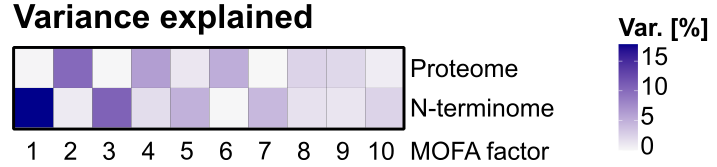

ProteolySee – the human plasma proteolytotype visualizer!
====================================================================

This interactive Shiny App allows you to visualize, investigate, and scan the N-terminome data from human SLE patients (PAPERREF: derzeit Proteolytic profiling of human SLE plasma reveals bioactive cleavage products in the human complement system? Demir et al.) in a convenient and accessible way. The presented data is generated using human EDTA-plasma from a cross-sectional SLE cohort and corresponding CTRL samples from the Aarhus University Hospital (in total n=167) and longitudinal, treatment-resolving SLE lupus nephritis (LN) patients from the University Hospital Hamburg-Eppendorf (n=8). Cleaved protein N-termini were identified by mass spectrometry-based high-throughput protein N-termini purification by the High-efficiency Undecanal-based N Termini EnRichment method (HUNTER, Weng, Demir et al., MCP, 2019 – derzeitiger Link: [Link](https://www.sciencedirect.com/science/article/pii/S1535947620317692)).

Contact: Arvid und ich oder Markus?  
Last update: DATUM

### The App is comprised of the following datasets available for filtering/selection in the App:

#### Correlation with clinical parameters

Pearson correlation factors for the exact N-terminus to known & measured clinical parameters for the corresponding patient. Higher Pearson correlation factors indicate a higher degree of correlation.

#### Log2 fold changes

Presents the log2 fold change for the exact N-terminus between SLE/CTRL from the cross-sectional cohort or the log2 fold change between responders/non-responders from the longitudinal cohort.

#### Proteomic data

Whole-protein abundance data was generated from the cross-sectional SLE & CTRL cohort during the N-termini purification workflow from the same samples and is presented as the log2 fold change between SLE/CTRL.

#### In vitro

Recombinant key proteases of the human complement system were used for an in-vitro digest of heat-inactivated (56 °C, 30 min.) human EDTA-plasma (n=4, 2x male & 2x female) for 2h at 37 °C. The proteases C1r/C1s represent the classical pathway, MASP-1 the lectin pathway, and MASP-3 the alternative pathway. The presented log2 fold changes represent only significantly cleaved substrates by the proteases and are controlled against catalytically inactive variants for MASP-1 and MASP-3 (log2 fold change active/inactive protease) or against a no protease control for C1r & C1s.

#### Eculizumab treatment

Eculizumab-treated pediatric STEC-HUS patients’ EDTA-plasma at 3 timepoints (D1, D8, D30) was subjected to HUNTER N-termini enrichment. Listed log2 fold changes are quantified in at least 2 patients over the mentioned timepoints.

#### MOFA factors

The cross-sectional SLE cohort N-terminome and proteome data was analyzed with the MOFA R package and divided into 10 factors, where factors 1, 3, 5, 7 and 10 were driven by N-termini.

